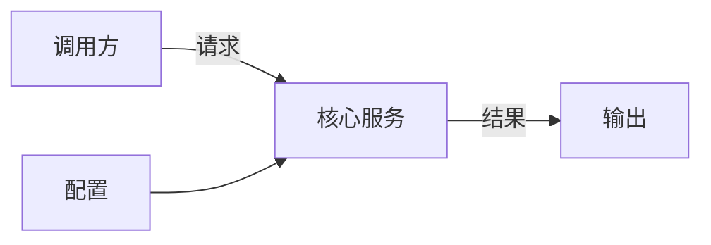
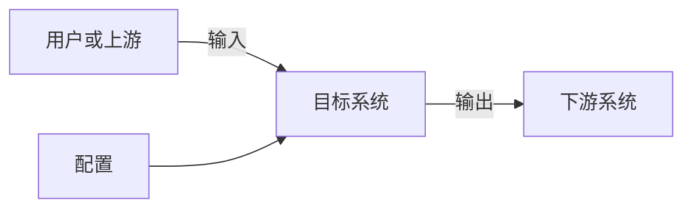
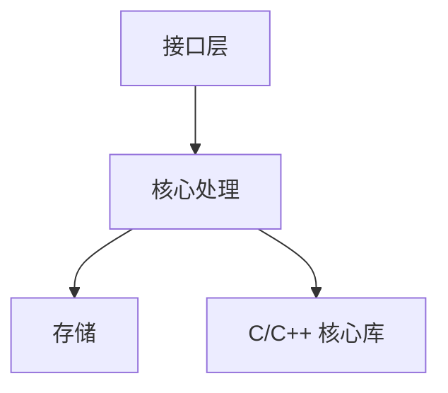
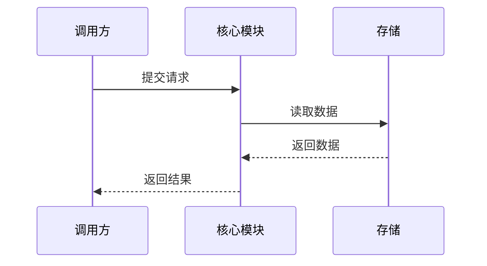
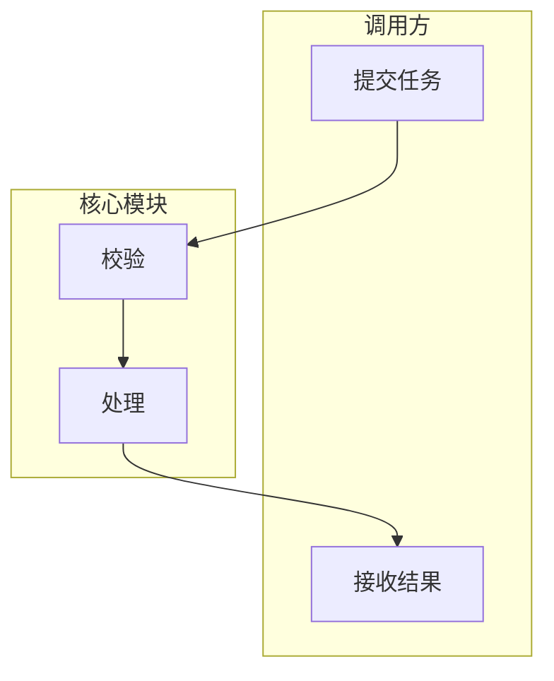
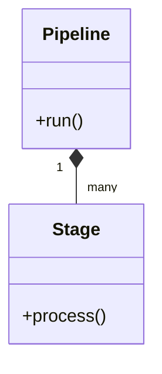
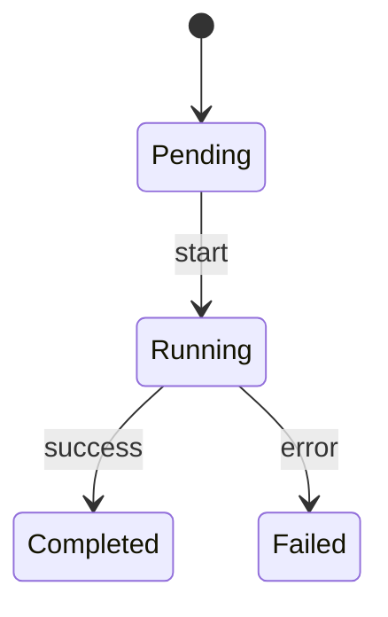
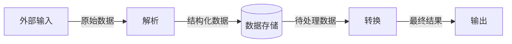

# Markdown 设计图模式

## 混合输出约定

每张图先写 `docs/diagrams/<name>.mmd`。

### SVG 模式

`render-manifest.json` 的 `mode` 为 `svg` 且文件存在时：

```markdown
**设计意图：** 展示系统边界和主要数据交换。


[Mermaid 源码](diagrams/system-context.mmd)

**关键解读：**

- 调用方通过请求进入核心服务。
- 核心服务读取配置并写出结果。
```

### Mermaid 模式

没有 SVG 时，把 `.mmd` 内容复制到围栏中：

````markdown
**设计意图：** 展示系统边界和主要数据交换。



**关键解读：**

- 调用方通过请求进入核心服务。
- 核心服务读取配置并写出结果。
````

不要同时显示 SVG 和 Mermaid 图，避免支持 Mermaid 的阅读器重复渲染。

## 系统上下文



## 模块关系



## 运行时序



## 泳道流程



## 核心类型



## 状态变化



## 数据流

数据流图不表示条件判断和循环，只说明数据来源、加工、存储和去向。



## 兼容性检查

- 含空格或标点的显示文字放在双引号中。
- 节点 ID 使用英文、数字和下划线，不使用 `end`。
- 子图写成 `subgraph laneId [显示名称]`。
- 不使用 `<br>`、HTML 实体、`click`、自定义颜色。
- 单个围栏只放一张图。
- 生成 SVG 前先用 `mmdc` 校验；失败则回退 Mermaid 模式并记录原因。
